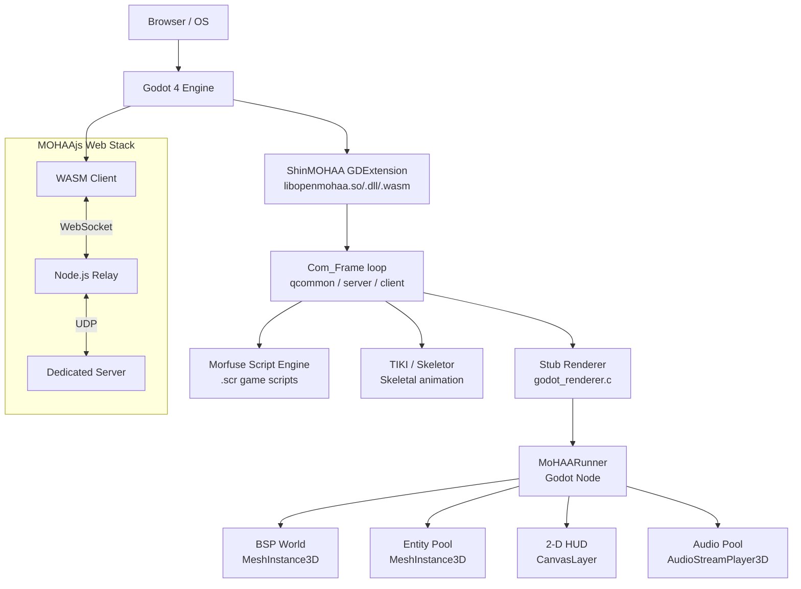

# ShinMOHAA / MOHAAjs

> A modern, high-performance engine port for **Medal of Honor: Allied Assault**, built on **Godot 4** as a GDExtension library and exported to **WebAssembly**.

ShinMOHAA brings the classic World War II tactical shooter into the modern era by wrapping the original [OpenMoHAA](https://github.com/openmohaa/openmohaa) engine (an ioquake3 / id Tech 3 derivative) inside Godot 4's rendering and input systems, while maintaining **bit-perfect compatibility** with all original game logic, assets, and network protocols.

[](LICENSE)
[]()
[](https://godotengine.org/)

---

## Table of Contents

1. [Highlights](#-highlights)
2. [Game Compatibility](#-game-compatibility)
3. [Repository Map](#️-repository-map)
4. [Architecture](#️-architecture)
5. [Engine Subsystems](#-engine-subsystems)
6. [Requirements](#-requirements)
7. [Quick Start](#-quick-start)
8. [Platform Build Guides](#️-platform-build-guides)
   - [Linux](#linux)
   - [Windows](#windows)
   - [macOS (native)](#macos-native)
   - [macOS (cross-compile from Linux with osxcross)](#macos-cross-compile-from-linux)
   - [Web / MOHAAjs (Emscripten / WASM)](#web--mohaajs-emscriptenwasm)
9. [Running the Game](#-running-the-game)
10. [Dedicated Server](#️-dedicated-server)
11. [Web Hosting & Docker](#-web-hosting--docker)
12. [Display & Resolution Settings](#️-display--resolution-settings)
13. [Configuration Reference](#️-configuration-reference)
14. [Useful Scripts](#-useful-scripts)
15. [Development Workflow](#-development-workflow)
16. [Troubleshooting](#-troubleshooting)
17. [Contributing](#-contributing)
18. [Disclaimer & Licence](#️-disclaimer--licence)

---

## 🚀 Highlights

| Feature | Details |
| :--- | :--- |
| **Godot 4 GDExtension** | Monolithic `.so`/`.dll`/`.wasm` — engine, server, client, AI, and script subsystems in one shared library. |
| **Full Asset Compatibility** | Original `.pk3`, `.scr`, `.tik`, BSP maps, and `.shader` files load without modification. |
| **Three Games in One** | Supports Medal of Honor: Allied Assault (`main/`), Spearhead (`mainta/`), and Breakthrough (`maintt/`). |
| **MOHAAjs (Web Client)** | Emscripten WASM build with IndexedDB asset caching and a WebSocket relay for UDP bridging. |
| **Morfuse Script Engine** | Full execution of `.scr` game scripts — quests, cinematics, AI behaviour, and total conversions. |
| **TIKI Skeletal Animation** | CPU-skinned skeletal models with multi-mesh bone remapping, LOD, and per-surface shader support. |
| **BSP World Rendering** | Planar, triangle-soup, Bézier patch, terrain, skybox, and brush sub-model surfaces through Godot's rendering server. |
| **3-D Positional Audio** | WAV streams from the VFS routed through `AudioStreamPlayer3D` pools. |
| **Cross-Platform** | Linux, Windows, macOS, and WebAssembly from a single SCons build. |
| **Modding-Friendly** | GDScript, C#, or C++ GDExtension extensions sit alongside the engine without touching C source. |

---

## 🎮 Game Compatibility

ShinMOHAA targets full compatibility with all three retail releases:

| Directory | Game | Pak files |
| :--- | :--- | :--- |
| `main/` | Medal of Honor: Allied Assault | `Pak0.pk3` – `Pak5.pk3` |
| `mainta/` | Medal of Honor: Allied Assault — Spearhead | `pak0.pk3` – `pak3.pk3` |
| `maintt/` | Medal of Honor: Allied Assault — Breakthrough | `pak0.pk3` – `pak3.pk3` |

The active game is selected at runtime via the `com_target_game` console variable:

```
0  →  Allied Assault   (default)
1  →  Spearhead
2  →  Breakthrough
```

All original network protocols, console commands, CVars, and server-side game scripts behave identically to the original engine. Existing dedicated server configurations (`server.cfg`) work without changes.

---

## 🗺️ Repository Map

```text
opm-godot/
├── openmohaa/              # Core engine source (C/C++) — NOT a git submodule
│   ├── code/
│   │   ├── godot/          # Godot-specific glue layer (all new bridge code lives here)
│   │   │   ├── MoHAARunner.cpp/.h        # Main Godot Node: Com_Init/Frame, scene, HUD, audio
│   │   │   ├── register_types.cpp        # GDExtension entry point
│   │   │   ├── stubs.cpp                 # ~100 no-op stubs for unused engine APIs
│   │   │   ├── godot_renderer.c          # Stub refexport_t + entity/poly/2-D capture buffers
│   │   │   ├── godot_sound.c             # Sound event capture (S_*/MUSIC_* queue)
│   │   │   ├── godot_input_bridge.c      # Godot key/mouse → engine SE_KEY/SE_MOUSE events
│   │   │   ├── godot_bsp_mesh.cpp/.h     # BSP world: mesh, terrain, lightmaps, marks
│   │   │   ├── godot_skel_model.cpp/.h   # TIKI skeletal mesh builder (ArrayMesh)
│   │   │   └── godot_shader_props.h      # Shared struct/enum definitions (C/C++ compatible)
│   │   ├── renderergl1/    # Real renderer source (GL calls stubbed; data management runs)
│   │   ├── qcommon/        # CVars, commands, VFS, memory, networking
│   │   ├── server/         # Dedicated / listen server
│   │   ├── client/         # Client state, prediction, keys, screen
│   │   ├── fgame/          # Server-side game logic, entities, AI
│   │   ├── cgame/          # Client-side game (separate cgame.so / cgame.dll)
│   │   ├── script/         # Morfuse script compiler & executor
│   │   ├── tiki/           # TIKI model & animation loading
│   │   ├── skeletor/       # Skeletal animation system
│   │   ├── uilib/          # MOHAA menu / widget system
│   │   ├── botlib/         # Bot pathfinding & AI
│   │   ├── gamespy/        # GameSpy master-server support
│   │   └── thirdparty/     # Recast/Detour navigation, SDL libs
│   └── SConstruct          # Build configuration for GDExtension
├── project/                # Godot 4 editor project (scenes, UI, shaders)
│   ├── Main.gd / Main.tscn # GDScript entry point
│   ├── project.godot       # Godot project settings
│   ├── openmohaa.gdextension
│   └── bin/                # Deployed .so/.dll/.dylib (git-ignored)
├── web/                    # Production web export and landing page
├── relay/                  # WebSocket-to-UDP relay server (Node.js)
├── scripts/                # Build automation and deployment utilities
├── docker/                 # Containerisation profiles for hosting
├── build.sh                # Top-level build & deploy script
├── launch.sh               # Game launcher (Linux native or web Docker stack)
└── docker-compose.yml      # Dev + prod Docker Compose profiles
```

---

## 🏗️ Architecture



### How It Works

ShinMOHAA is a **bridge**, not a rewrite. The original OpenMoHAA C/C++ engine is compiled as a shared library (`libopenmohaa`) and loaded by Godot as a GDExtension. Every frame, the engine's `Com_Frame()` function drives the full client–server tick, feeding render commands into intermediate capture buffers. A custom Godot `Node3D` (`MoHAARunner`) reads those buffers each frame and translates them into native Godot scene objects:

| Engine output | Godot representation |
| :--- | :--- |
| BSP world surfaces | `ArrayMesh` + `MeshInstance3D` |
| Skeletal entity renders | CPU-skinned `ArrayMesh` pool |
| 2-D HUD draw calls | `RenderingServer` canvas items |
| Sound events | `AudioStreamPlayer3D` pool |
| Camera (`refdef_t`) | `Camera3D` transform + FOV |
| Dynamic lights | `OmniLight3D` pool |

The real renderer's **data-management code** (shader text parsing, image loading, model registration) runs via `R_Init()` called from `GR_BeginRegistration()`. Only the actual OpenGL draw calls are stubbed out. This means all shader definitions, texture paths, and model data are resolved by the original engine code — the Godot side simply consumes the results.

### Per-Frame Data Flow

```
Com_Frame()
  ├── SV_Frame()             → server logic, entity updates, script execution
  ├── CL_Frame()             → client prediction, snapshot processing
  │   └── CG_DrawActiveFrame()
  │       └── GR_RenderScene() → captures refdef, entity buffer, dlights
  ├── SCR_UpdateScreen()     → captures 2-D HUD commands
  └── S_Update()             → captures sound events

MoHAARunner::_process()
  ├── Com_Frame()
  ├── update_camera()           → refdef → Camera3D
  ├── update_entities()         → entity buffer → MeshInstance3D pool
  ├── update_2d_overlay()       → 2-D cmds → CanvasLayer
  ├── update_audio()            → sound events → AudioStreamPlayer3D pool
  ├── update_polys/swipes/marks → effect MeshInstance3Ds
  └── update_shader_animations()→ tcMod UV offsets
```

---

## 🔩 Engine Subsystems

### `libopenmohaa` (GDExtension)

The monolithic shared library that encapsulates:

- **`qcommon`** — CVars, command buffer, VFS (`.pk3` mounting), memory zones, console, networking stack.
- **`server`** — Dedicated / listen-server game simulation, entity management, bot pathfinding.
- **`client`** — Client prediction, input, snapshot processing, HUD rendering commands.
- **`fgame`** — Server-side game DLL (entities, AI state machines, weapon logic, mission scripts).
- **`cgame`** — Client-side game module (entity interpolation, effects, HUD data) — compiled as a *separate* `cgame.so`/`cgame.dll` and loaded at runtime via `dlopen`.
- **`script`** — Morfuse script compiler and virtual machine, executing `.scr` files for game events, cinematics, and AI.
- **`tiki` / `skeletor`** — TIKI model loader and skeletal animation system.
- **`uilib`** — MOHAA menu/widget system used for in-game menus and HUD.
- **`botlib`** — Navigation mesh, area flooding, and AI decision-making using Recast/Detour.
- **`renderergl1`** — Real renderer data-management layer; GL draw calls are no-ops under Godot.

### Morfuse Script Engine

Executes legacy `.scr` files that drive game events, AI dialogue, cutscenes, and mission objectives. It has been modernised for C++17 and compiles directly into the main library, providing full parity with the original game's scripted behaviours.

### MOHAAjs (Web Client)

A WebAssembly build produced via Emscripten. Key features:

- **IndexedDB asset cache** — `.pk3` files are fetched once and stored in the browser's IndexedDB for near-instant subsequent loads.
- **On-demand streaming** — only the assets needed for the current map are downloaded.
- **WebSocket relay** — since browsers cannot send raw UDP, a lightweight Node.js relay service bridges WebSocket connections to the game's UDP network stack.
- **SharedArrayBuffer threading** — multi-threaded builds use `SharedArrayBuffer` for the engine's memory zones; the hosting server must send the required COOP/COEP HTTP headers.

### BSP World Renderer

Parses id Tech 3 BSP files and constructs Godot meshes for every surface type:

- **Planar surfaces** — textured polygons with lightmaps.
- **Triangle-soup surfaces** — arbitrary triangle lists (complex geometry).
- **Bézier patch surfaces** — curved surfaces tessellated on the CPU.
- **Terrain / deform surfaces** — MOHAA terrain grid with per-vertex colour.
- **Brush sub-models** — doors, platforms, and other movers driven by server-side entity logic.
- **Skybox** — environment cubemap extracted from sky shader definitions.

Lightmaps (128 × 128 × RGB) are uploaded as `ImageTexture` resources and modulated onto surfaces through Godot's `StandardMaterial3D`.

### TIKI Skeletal Model System

TIKI (`.tik`) files describe character and prop models, combining:

- **Bind-pose mesh** from SKD/SKC/SKB model files.
- **Per-frame animation** from SKC animation channels.
- **CPU skinning** — bone weights applied per vertex each frame via `TIKI_GetSkelAnimFrame()`.
- **Per-surface shader assignment** using the real renderer's shader table.
- **Multi-mesh LOD** — progressive collapse indices from `skelHeaderGame_t.lodIndex`.

---

## 📋 Requirements

### Desktop Development

| Dependency | Version | Notes |
| :--- | :--- | :--- |
| **Godot** | 4.2+ | Must be in `PATH` as `godot` |
| **GCC** or **Clang** | GCC 11+ / Clang 14+ | MSVC 2022+ on Windows |
| **SCons** | Latest | `pip install scons` |
| **Python** | 3.x | Required by SCons |
| **Bison** | 3.x | Script parser generation |
| **Flex** | 2.x | Script lexer generation |
| **pkg-config** | Any | Used by build scripts |
| **zlib** | System | Compression (usually pre-installed) |
| **libdl** | System | Dynamic linking (Linux only) |

### Game Assets (Runtime Only)

You must own a legal copy of Medal of Honor: Allied Assault (and optionally its expansions). Copy the `.pk3` files to:

```
~/.local/share/openmohaa/main/        # Allied Assault:  Pak0.pk3 – Pak5.pk3
~/.local/share/openmohaa/mainta/      # Spearhead:       pak0.pk3 – pak3.pk3
~/.local/share/openmohaa/maintt/      # Breakthrough:    pak0.pk3 – pak3.pk3
```

Game assets are **not** included in this repository and are **not** required to compile the engine.

### Web Hosting

| Dependency | Version | Notes |
| :--- | :--- | :--- |
| **Node.js** | 18+ | WebSocket relay server |
| **Docker & Docker Compose** | Any modern | Recommended for production |
| **Emscripten SDK (emsdk)** | Latest | Required to build WASM |
| **Web server** | Nginx / Apache | Must send COOP/COEP headers |

---

## ⚡ Quick Start

### 1. Clone the Repository

```bash
git clone --recursive https://github.com/elgansayer/opm-godot.git
cd opm-godot
```

> The `--recursive` flag initialises the `godot-cpp` submodule (branch 4.2).
> The `openmohaa/` directory is regular tracked source, **not** a submodule.

### 2. Install Build Tools (Ubuntu / Debian example)

```bash
sudo apt-get update
sudo apt-get install -y build-essential gcc g++ bison flex pkg-config zlib1g-dev
pip install scons
```

### 3. Build the GDExtension

```bash
./build.sh linux
```

This compiles `libopenmohaa.so` and `cgame.so` and copies them into `project/bin/`.

### 4. Add Game Assets

```bash
mkdir -p ~/.local/share/openmohaa/main
cp /path/to/mohaa/main/*.pk3 ~/.local/share/openmohaa/main/
```

### 5. Launch

```bash
./launch.sh linux
```

Or open the `project/` folder directly in the Godot 4 editor.

---

## 🖥️ Platform Build Guides

### Linux

```bash
# Install dependencies (Ubuntu / Debian)
sudo apt-get install -y build-essential gcc g++ bison flex pkg-config zlib1g-dev
pip install scons

# Build
./build.sh linux

# Output files
#   openmohaa/bin/libopenmohaa.so   (~57 MB debug)
#   openmohaa/bin/libcgame.so       (~4.7 MB)
#   project/bin/libopenmohaa.so     (deployed copy)
#   project/bin/cgame.so            (deployed copy)
```

To build a release (optimised, smaller) binary:

```bash
cd openmohaa && scons platform=linux target=template_release -j$(nproc)
```

### Windows

Cross-compilation from Linux using MinGW-w64:

```bash
sudo apt-get install -y mingw-w64
./build.sh windows
```

Or natively on Windows (requires MSVC 2022 or MinGW in PATH):

```bash
# From a Developer Command Prompt or Git Bash
./build.sh windows
```

Output: `project/bin/openmohaa.dll` and `project/bin/cgame.dll`.

### macOS (native)

```bash
# Install Xcode command-line tools and Homebrew dependencies once
xcode-select --install
brew install scons bison flex

# Build universal (arm64 + x86_64) dylibs
./build.sh macos

# Output: project/bin/libopenmohaa.dylib, project/bin/cgame.dylib
```

### macOS (cross-compile from Linux)

Cross-compiling macOS binaries from Linux requires [osxcross](https://github.com/tpoechtrager/osxcross).

```bash
# Step 1 — validate your environment
./scripts/setup-macos-build.sh

# Step 2 — generate a reusable environment file
./scripts/configure-macos-cross-env.sh
source scripts/env.macos-cross.sh   # sets OSXCROSS_ROOT, PATH, etc.

# Step 3 — build (specify arch explicitly to avoid universal-link issues)
./build.sh macos arch=x86_64
# or
./build.sh macos arch=arm64
```

> **Notes**
> - `osxcross_sdk` defaults to `darwin16`; override with `osxcross_sdk=<your-sdk-tag>` if needed.
> - If you have access to a Mac, a native build is simpler and more reliable.
> - Without `OSXCROSS_ROOT` on Linux, `./build.sh macos` will fail by design.

### Web / MOHAAjs (Emscripten/WASM)

```bash
# Step 1 — install Emscripten SDK
git clone https://github.com/emscripten-core/emsdk.git ~/emsdk
cd ~/emsdk && ./emsdk install latest && ./emsdk activate latest
source ~/emsdk/emsdk_env.sh
cd -

# Step 2 — build (debug WASM by default)
./build.sh web

# Step 3 — build optimised release WASM
./build.sh web --release

# Output: web/mohaa.html, web/mohaa.js, web/mohaa.wasm, web/mohaa.pck
```

After building, host the `web/` directory with a server that sends the required security headers (see [Web Hosting & Docker](#-web-hosting--docker)).

---

## 🎮 Running the Game

### Linux (native)

```bash
./launch.sh linux
```

Advanced launch examples:

```bash
# Start a specific map immediately
./launch.sh linux "+map obj/obj1"

# Enable cheats
./launch.sh linux "+set cheats 1"

# Play Spearhead expansion
./launch.sh linux "+set com_target_game 1"

# Play Breakthrough expansion
./launch.sh linux "+set com_target_game 2"

# Run as a dedicated server
./launch.sh linux --dedicated --map=dm/mohdm1

# Execute a startup config
./launch.sh linux --exec=server.cfg
```

### Web

```bash
./launch.sh web
# Opens http://localhost:8086/mohaa.html in your browser

# Pass CVars via URL query string
./launch.sh web "+set com_target_game 1"
# Opens http://localhost:8086/mohaa.html?com_target_game=1
```

---

## 🖧 Dedicated Server

ShinMOHAA fully supports headless dedicated-server operation.

### Starting a Dedicated Server (Native)

```bash
godot --path project/ --headless -- +set dedicated 1 +exec server.cfg
```

### Example `server.cfg`

```
set sv_hostname "My ShinMOHAA Server"
set sv_maxclients 16
set g_gametype 2        // Team Deathmatch
set sv_pure 1           // Enforce pak integrity
map dm/mohdm1
```

### Headless Smoke Test

```bash
./build.sh test
# or
cd project && godot --headless --quit-after 5000
```

### Web Preflight Test

```bash
# Verifies local web stack and map-loading prerequisites:
# - nginx serves mohaa.html/mohaa.js/main/cgame.so
# - COOP/COEP headers are present
# - /assets/main JSON listing works
# - pak0..pak6 are discoverable for server-side preload
./scripts/test-web.sh
```

### Web Browser E2E Test

```bash
# Runs full browser automation with Playwright:
# - starts/verifies local web stack
# - opens mohaa.html with a startup map
# - clicks through loader UI
# - waits for deterministic map-loaded signal
./scripts/test-web-e2e.sh
```

### Web Relay

Browsers cannot send raw UDP packets, so web clients connect through a lightweight Node.js WebSocket relay:

```bash
cd relay
npm install
node mohaa_relay.js       # listens on ws://<host>:27910
```

The relay forwards WebSocket frames to/from the game server's UDP port (default `27910`).

---

## 🐳 Web Hosting & Docker

A `docker-compose.yml` at the repository root provides two deployment profiles.

### Dev Profile (default)

Mounts your local `web/` build output and game assets directly — no image build required.

```bash
# Set the path to your game assets directory
export ASSET_PATH=/path/to/mohaa-assets

# Start nginx + relay
docker compose up
```

The game is served at **http://localhost:8086/mohaa.html**.

### Prod Profile (pre-built GHCR image)

Pulls the latest pre-built image from the GitHub Container Registry — suitable for Portainer or cloud deployments.

```bash
export ASSET_PATH=/path/to/mohaa-assets
docker compose --profile prod up -d
```

### Required HTTP Headers

For multi-threaded WASM builds (`SharedArrayBuffer`), your web server **must** send:

```
Cross-Origin-Opener-Policy: same-origin
Cross-Origin-Embedder-Policy: require-corp
```

The included `docker/web/nginx.conf` already sets these headers. If you use a different web server, add them to your virtual host configuration.

---

## 🖥️ Display & Resolution Settings

### Resolution Modes (`r_mode`)

```
set r_mode 3           // 640×480  (classic)
set r_mode 4           // 800×600
set r_mode 5           // 960×720
set r_mode 6           // 1024×768
set r_mode 7           // 1152×864
set r_mode 8           // 1280×1024
set r_mode 9           // 1600×1200
set r_mode -1          // Custom resolution (use r_customwidth / r_customheight)
set r_customwidth  1920
set r_customheight 1080
vid_restart
```

### Fullscreen Aspect Ratio (`r_fullscreenAspect`)

| Value | Mode | Behaviour |
| :---: | :--- | :--- |
| **0** (default) | Keep | Renders at the `r_mode` resolution; adds pillarboxes or letterboxes to preserve the aspect ratio. Best for a retro feel. |
| **1** | Stretch | Renders at the `r_mode` resolution and stretches to fill the display. May distort on aspect-ratio mismatches. |
| **2** | Native | Ignores `r_mode` in fullscreen and renders at the display's native resolution. Sharpest image; HUD size is unaffected by `r_mode`. |

**Recommended for widescreen monitors:**

```
set r_mode -1
set r_customwidth  2560
set r_customheight 1080
set r_fullscreen 1
vid_restart
```

---

## ⚙️ Configuration Reference

All engine settings follow the original MOHAA CVar system. Commonly used CVars:

### Graphics

| CVar | Default | Description |
| :--- | :--- | :--- |
| `r_mode` | `6` | Resolution preset (see table above) |
| `r_fullscreen` | `0` | `1` = fullscreen, `0` = windowed |
| `r_customwidth` | `1600` | Width when `r_mode -1` |
| `r_customheight` | `1024` | Height when `r_mode -1` |
| `r_fullscreenAspect` | `0` | Fullscreen aspect handling (0/1/2) |
| `r_picmip` | `1` | Texture MIP bias; higher = smaller textures |
| `r_textureDetails` | `1` | Enables detail textures and conditional shader blocks |

### Game / Server

| CVar | Default | Description |
| :--- | :--- | :--- |
| `com_target_game` | `0` | Active game: `0`=AA, `1`=SH, `2`=BT |
| `com_basegame` | `main` | Base game directory |
| `sv_maxclients` | `20` | Maximum simultaneous players |
| `sv_pure` | `1` | Enforce pak-file integrity on clients |
| `g_gametype` | `0` | Game mode: `0`=FFA DM, `2`=TDM, `3`=RB, `4`=Obj, `5`=T-Obj |
| `cheats` | `0` | Enable/disable cheat commands |

### Network

| CVar | Default | Description |
| :--- | :--- | :--- |
| `sv_hostname` | `ShinMOHAA` | Server name shown in browser |
| `sv_master1`–`3` | Various | Master-server addresses for listing |
| `cl_maxpackets` | `30` | Outgoing packet rate cap |
| `rate` | `25000` | Client bandwidth cap (bytes/s) |

### Audio

| CVar | Default | Description |
| :--- | :--- | :--- |
| `s_volume` | `0.8` | Master sound volume |
| `s_musicvolume` | `1.0` | Music volume |
| `s_khz` | `22` | Sound sampling rate (11, 22, 44) |

---

## 📜 Useful Scripts

| Script | Description |
| :--- | :--- |
| `build.sh <target>` | Top-level entry point: `linux`, `windows`, `macos`, `web`, `deploy`, `clean`, `test` |
| `launch.sh <platform>` | Launch helper: `linux` (native Godot) or `web` (Docker stack + browser) |
| `scripts/build-desktop.sh <platform>` | Desktop SCons builder invoked by `build.sh` |
| `scripts/build-web.sh [--release]` | Emscripten / Godot web export pipeline |
| `scripts/setup-macos-build.sh` | macOS/native or Linux/osxcross preflight checks |
| `scripts/configure-macos-cross-env.sh` | Generates `scripts/env.macos-cross.sh` for repeatable cross-builds |
| `scripts/deploy.sh` | Deploys web build + pushes image to GHCR / Portainer |
| `scripts/test.sh` | Headless smoke-test wrapper |
| `scripts/test-viewmodel.sh` | Viewmodel-specific smoke test |

---

## 🔧 Development Workflow

### Typical Edit–Build–Test Cycle

```bash
# 1. Edit source in openmohaa/code/godot/ or openmohaa/code/renderergl1/ …

# 2. Build (incremental — only changed files are recompiled)
cd openmohaa && scons platform=linux target=template_debug -j$(nproc) dev_build=yes

# 3. Deploy binaries
cp -f openmohaa/bin/libopenmohaa.so project/bin/
cp -f openmohaa/bin/libcgame.so     project/bin/cgame.so

# 4. Smoke test
cd project && godot --headless --quit-after 5000
```

### Forcing a Full Rebuild

SCons caches dependency information in `.sconsign.dblite`. If you edit a widely-included header (e.g. `qcommon.h`), delete this file to force a full rebuild:

```bash
rm openmohaa/.sconsign.dblite
./build.sh linux
```

### Adding Engine Patches

All modifications to upstream engine files **must** be wrapped in `#ifdef GODOT_GDEXTENSION` / `#endif` guards to keep the code mergeable with upstream OpenMoHAA:

```c
#ifdef GODOT_GDEXTENSION
    // Godot-specific behaviour: never block — Godot drives the frame rate.
    NET_Sleep(0);
    break;
#else
    // Original engine code untouched.
    NET_Sleep(sv_timeout->value);
    break;
#endif
```

### Active Preprocessor Defines

| Target | Defines |
| :--- | :--- |
| Main `.so` / `.dll` | `DEDICATED`, `GODOT_GDEXTENSION`, `GAME_DLL`, `BOTLIB`, `WITH_SCRIPT_ENGINE`, `APP_MODULE` |
| `cgame.so` / `cgame.dll` | `CGAME_DLL` only |
| Web WASM | Same as main `.so` + Emscripten defines |

### Adding New Godot-Side Features

When you need to expose engine state to `MoHAARunner.cpp` but cannot `#include` engine headers directly (macro/type collisions with `godot-cpp`), add a thin C accessor function:

1. Create or extend an accessor file in `openmohaa/code/godot/` (e.g. `godot_server_accessors.c`).
2. Declare the function signature in a companion header.
3. Call it from `MoHAARunner.cpp` via an `extern "C"` declaration.

Existing accessor files:

| File | Purpose |
| :--- | :--- |
| `godot_server_accessors.c` | `sv.state`, `svs.mapName`, `svs.iNumClients` |
| `godot_client_accessors.cpp` | `keyCatchers`, `in_guimouse`, `paused`, `SetGameInputMode` |
| `godot_vfs_accessors.c` | `Godot_VFS_ReadFile` / `Godot_VFS_FreeFile` |
| `godot_input_bridge.c` | Key/mouse → `Com_QueueEvent(SE_KEY/SE_MOUSE/SE_CHAR)` |
| `godot_skel_model_accessors.cpp` | TIKI mesh extraction, bone preparation, CPU skinning |
| `renderergl1/godot_shader_accessors.c` | Bridges real `shader_t` → `GodotShaderProps` |

---

## ❓ Troubleshooting

### Build Issues

| Problem | Solution |
| :--- | :--- |
| `scons: command not found` | Run `pip install scons` (ensure Python is in `PATH`). |
| `bison: command not found` | Install `bison` via your system package manager. |
| `godot-cpp` headers missing | Run `git submodule update --init --recursive`. |
| Stale object files cause link errors | Delete `openmohaa/.sconsign.dblite` and rebuild. |
| macOS cross-compile fails without `OSXCROSS_ROOT` | Either build natively on macOS or set `OSXCROSS_ROOT`. |

### Runtime Issues

| Problem | Solution |
| :--- | :--- |
| **"Could not find any files in game directory"** | Ensure `.pk3` files are in `~/.local/share/openmohaa/main/`. |
| **Black screen / no world** | Check that `Pak0.pk3`–`Pak5.pk3` are present and readable. |
| **Crash on map load** | Verify game assets match the selected `com_target_game`. |
| **Audio silent** | Confirm Godot's audio driver is initialised; check `s_volume`. |
| **Wrong expansion loaded** | Set `com_target_game` to `0` (AA), `1` (SH), or `2` (BT). |

### Web Issues

| Problem | Solution |
| :--- | :--- |
| **`SharedArrayBuffer is not defined`** | The hosting server must send `COOP: same-origin` and `COEP: require-corp` headers. |
| **WebSocket connection refused** | Ensure the Node.js relay (`relay/mohaa_relay.js`) is running and reachable. |
| **`.pk3` files never load** | Check that `ASSET_PATH` is set and that the Docker volume mount is correct. |
| **Blank page / JS errors** | Open the browser console; look for WASM instantiation failures. Ensure you are using a threaded export if `SharedArrayBuffer` is available. |
| **Very slow first load** | Normal — `.pk3` files are being streamed and cached in IndexedDB. Subsequent loads are near-instant. |

### Debugging Tips

- Enable the in-engine console with the **tilde / grave** key (`` ` `` / `~`, same key on US keyboards) and run commands directly.
- Add `+set developer 1` to the launch arguments for verbose engine logging.
- Godot prints `print()` output from `Main.gd` to the editor console / `stdout`.
- `console.log` in the repository root contains the most recent headless run output.

---

## 🤝 Contributing

Contributions are welcome! Please read the guidelines below before opening a pull request.

### Code Style

- **Language:** British English (en-GB) in comments and documentation.
- **C / C++:** Follow the existing style in each directory; `clang-format` is acceptable as a guide.
- **Engine patches:** Wrap every change to upstream OpenMoHAA files in `#ifdef GODOT_GDEXTENSION`.
- **No raw `malloc`/`free`** in new C++ code — prefer `std::unique_ptr`, `std::vector`, or `Z_Malloc`/`Z_Free` for engine-lifetime allocations.
- **No custom parsers** — use the engine's `COM_ParseExt()`, `Q_stricmp()`, and related utilities rather than writing new string-processing code.
- **No fallbacks or shortcuts** — aim for 1:1 parity with original MOHAA behaviour.

### Workflow

1. Fork the repository and create a feature branch (`git checkout -b feature/my-feature`).
2. Make your changes following the coding guidelines above.
3. Verify the build compiles cleanly: `./build.sh linux`.
4. Run the smoke test: `./build.sh test`.
5. Open a pull request with a clear description of what changed and why.

### Reporting Issues

When reporting a bug please include:

- The game version (`com_target_game`, expansion).
- The build target (Linux / Windows / macOS / Web).
- Steps to reproduce, including any console commands used.
- The content of `console.log` (generated in the repository root on each run).

---

## ⚖️ Disclaimer & Licence

**Disclaimer:** This project is a non-commercial fan implementation. It is not affiliated with, endorsed by, or sponsored by Electronic Arts Inc. or 2015, Inc. "Medal of Honor: Allied Assault", "Spearhead", "Breakthrough", and related trademarks and assets are the intellectual property of their respective owners. You must own a legal copy of the game to use this software.

**This repository does not include any game assets.** All `.pk3` files, textures, models, and sound files from the original game must be supplied by the end user.

This project is licensed under the **GNU General Public License v2.0**. See [LICENSE](LICENSE) for the full text.

Built with ❤️ for the MOHAA community.
