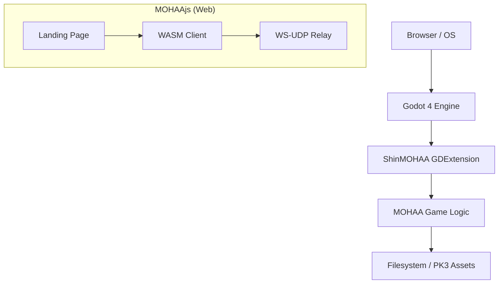

# ShinMOHAA / MOHAAjs

A modern, high-performance engine for **Medal of Honor: Allied Assault**, built for **Godot 4** as a GDExtension library. 

ShinMOHAA brings the classic tactical shooter into the modern era, leveraging Godot's powerful rendering and input systems while maintaining bit-perfect compatibility with original game logic.

## Highlights
- **Godot 4 Native Power**: Runs as a high-performance GDExtension, integrated directly into the Godot editor.
- **MOHAAjs (Web)**: Specialized WebAssembly client with optimized asset streaming and persistent IndexedDB caching.
- **Cross-Expansion Support**: Native support for Allied Assault, Spearhead (`mainta`), and Breakthrough (`maintt`).
- **Modernized Rendering**: Enhanced BSP support, lightmaps, shaders, and high-fidelity skeletal animations (TIKI).
- **Multiplayer Ready**: Includes a WebSocket-to-UDP relay for seamless web-based multiplayer.

## Advantages
- **Instant Play (Web)**: No installation required for the web client; just point to your asset folder and play in the browser.
- **Cross-Platform**: Seamlessly runs on Linux, Windows, macOS, and Web with the same codebase.
- **Persistent Storage**: Automated IndexedDB caching means assets are only downloaded or loaded once.
- **Zero-Trust Security**: Browser-level sandboxing ensures a safe environment for players.
- **Auto-Syncing**: Any server-side mods, maps, or files missing from the player's local installation are automatically downloaded and cached by the client.
- **Developer Friendly**: Built with modern C++, Godot's GDExtension, and standard web technologies (HTML5/WASM).

## Possibilities
- **Enhanced Graphics**: Real-time shadows, PBR materials, and advanced post-processing via Godot's Vulkan/Forward+ renderers.
- **Modding Revolution**: Use Godot's visual scripting or GDScript to create total conversions more easily than ever.
- **VR Support**: Native OpenXR integration in Godot opens the door for a full MOHAA VR experience.
- **AI Modernization**: Replace legacy pathfinding with Godot's NavigationServer and implement complex behaviors using **LimboAI** for state-of-the-art NPC decision making.
- **Unified Multiplayer**: Cross-play between native desktop clients and browser-based players via the WebSocket relay.
- **Mobile Export**: Potential for Android and iOS versions using Godot's mobile export templates.
```
opm-godot/
├── openmohaa/          # Core engine source & Godot GDExtension glue
├── project/            # Main Godot 4 editor project
├── exports/web/        # Templates and configurations for MOHAAjs (Web)
├── relay/              # WebSocket-to-UDP relay server (Node.js)
├── scripts/            # Build automation and deployment utilities
└── web/                # Production web export directory
```

## Architecture


## Quick Start

1. **Prerequisites**: Ensure you have Godot 4.3+, SCons, and a C++ compiler (GCC/Clang) installed.
2. **Clone**: `git clone --recursive https://github.com/elgansayer/opm-godot.git`
3. **Build**: Run `./build.sh` to compile the GDExtension.
4. **Acquire Assets**: Copy your legal `.pk3` files into the appropriate `main/` folders.
5. **Launch**: Open the `project/` folder in Godot or run `cd project && godot`.

## Component Details

### ShinMOHAA (Native)
The native implementation is a C++ GDExtension that bridges the gap between the original engine's low-level logic and Godot's modern systems. It handles:
- **BSP Rendering**: Opaque and transparent geometry with lightmap support.
- **Tiki Animations**: Real-time skeletal animation and attachment systems.
- **Script Engine**: Full execution of `.scr` files for game logic.

### MOHAAjs (Web)
MOHAAjs is the WebAssembly-based client that runs directly in the browser. It features:
- **Intelligent Loader**: Automatically detects and maps `main`, `mainta`, and `maintt` folders.
- **Persistent Caching**: Uses IndexedDB to store `.pk3` files locally, significantly reducing subsequent load times.
- **Shared Memory**: Leverages WASM threads and SharedArrayBuffer for smooth performance.

## Disclaimer & License

**Disclaimer**: MOHAAjs is an independent fan project and is **not affiliated with, endorsed by, or connected to the OpenMoHAA project**, Electronic Arts (EA), or any original rights holders of Medal of Honor: Allied Assault. All trademarks belong to their respective owners. You must own a legitimate copy of the game to use this application.

Users must provide their own legally owned game files. All gameplay content is limited to files provided by the user.

**License**: The engine is an independent implementation based on open-source technology licensed under the **GNU General Public License v2**. 

Built with ❤️ by the community
