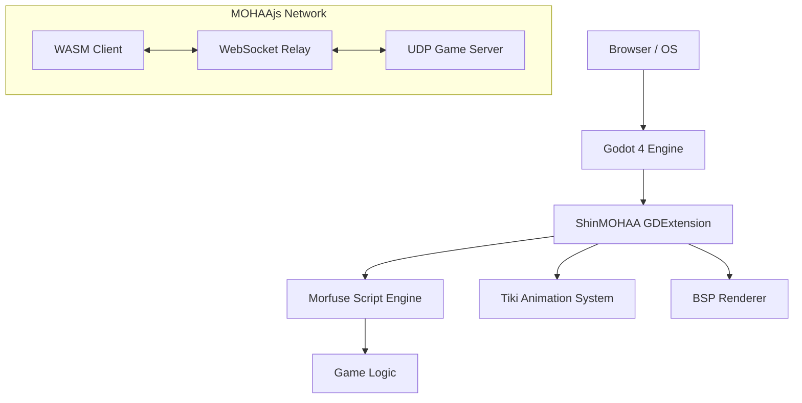

# ShinMOHAA / MOHAAjs

A modern, high-performance engine for **Medal of Honor: Allied Assault**, built for **Godot 4** as a GDExtension library and **WebAssembly**. 

ShinMOHAA brings the classic tactical shooter into the modern era, leveraging Godot's powerful rendering and input systems while maintaining bit-perfect compatibility with original game logic.

---

## 🚀 Highlights

- **Godot 4 Native Power**: High-performance GDExtension integration, bringing MOHAA into a modern editor environment.
- **MOHAAjs (WebClient)**: A specialized WebAssembly client with optimized asset streaming and persistent IndexedDB caching.
- **Modern Rendering**: PBR-ready materials, enhanced BSP support, and high-fidelity skeletal animations (TIKI).
- **Morfuse Script Engine**: Full parity execution of `.scr` files for game logic and total conversions.
- **Cross-Platform Reach**: Support for Windows, Linux, macOS, Android, iOS, and Web from a single codebase.
- **Zero-Trust Security**: Browser-level sandboxing for the web client ensures a safe environment for players.
- **Modding Revolution**: Use Godot's visual tools, GDScript, or C++ to extend the game beyond its original limits.

---

## 🗺️ Repository Map

```text
opm-godot/
├── openmohaa/          # Core engine source (C/C++)
│   ├── code/           # Engine subsystems (fgame, qcommon, script, tiki, etc.)
│   └── SConstruct      # Build configuration for GDExtension
├── project/            # Godot 4 editor project (Scenes, UI, Shaders)
├── web/                # Production web export and landing page
├── relay/              # WebSocket-to-UDP relay server (Node.js)
├── scripts/            # Build automation and deployment utilities
├── docker/             # Containerization profiles for hosting
└── exports/            # Platform-specific export templates
```

---

## 🏗️ Architecture



The engine acts as a bridge between the original game logic and Godot's modern subsystems. Filesystem calls are mapped to Godot's VFS, and rendering commands are translated into high-level Godot Spatial nodes and Shaders.

---

## 📋 Requirements

### Development (Desktop)
- **Godot 4.3+**
- **C++ Compiler**: GCC 11+, Clang 14+, or MSVC 2022+
- **SCons**: For GDExtension compilation
- **Python 3.x**: Required for SCons
- **Bison & Flex**: For script parser generation

### Hosting (Web)
- **Node.js 18+**: For the WebSocket relay
- **Docker & Docker Compose**: Recommended for production deployment
- **Web Server**: Nginx or Apache with COOP/COEP headers enabled

---

## ⚡ Quick Start

### 1. Clone the Repository
```bash
git clone --recursive https://github.com/elgansayer/opm-godot.git
cd opm-godot
```

### 2. Build the GDExtension
```bash
./scripts/build-native.sh
```

### 3. Add Game Assets
Copy your legal `.pk3` files into `project/main/`. The loader also supports `mainta` (Spearhead) and `maintt` (Breakthrough).

### 4. Launch
Open the `project/` folder in the Godot Editor or run:
```bash
godot --path project/
```

---

## 🛠️ Component Details

### `libopenmohaa` (GDExtension)
The heart of the project. It encapsulates the original engine's `qcommon`, `server`, and `client` subsystems. It handles memory management, VFS mapping, and provides the bridge to Godot's `ClassDB`.

### Morfuse
The revamped script engine that executes legacy `.scr` files. It has been modernized for C++17 and provides deep integration with the Godot property system.

### MOHAAjs (Web Client)
A specialized build target that uses Emscripten. It features an **Intelligent Loader** that streams `.pk3` files on demand and caches them in **IndexedDB** for near-instant subsequent loads.

---

## 🖥️ Dedicated Server

ShinMOHAA supports running in a headless "Dedicated" mode.

### Running Headless (Native)
```bash
godot --path project/ --headless --args +set dedicated 1 +exec server.cfg
```

### Web Relay
Because browsers cannot speak raw UDP, a **WebSocket Relay** is required for web-to-game communication:
```bash
cd relay
npm install
node mohaa_relay.js
```

---

## 📱 Godot Exports

Godot's powerful export system allows ShinMOHAA to be deployed almost anywhere:

| Platform | Notes |
| :--- | :--- |
| **Windows/Linux/macOS** | Desktop binaries with full Vulkan/Forward+ support. |
| **Web (MOHAAjs)** | Single-threaded or Multi-threaded builds; requires COOP/COEP headers. |
| **Android** | Requires the Android SDK/NDK; supports touch interface mapping. |
| **iOS** | Requires Xcode and an active Apple Developer account. |

*Note: For mobile and consoles, ensure your assets are optimized and stored in a reachable path.*

---

## �️ Display Settings

### Resolution Modes (`r_mode`)

Use the built-in resolution list or custom sizes:

```
set r_mode 3           // 640x480 (classic)
set r_mode 6           // 1024x768
set r_mode 9           // 1600x1200 (high-res)
set r_mode -1          // Custom resolution
set r_customwidth 1920
set r_customheight 1080
vid_restart
```

### Fullscreen Aspect Ratio (`r_fullscreenAspect`)

Controls how the engine renders in fullscreen on displays with different aspect ratios:

| Value | Mode | Behaviour |
|-------|------|-----------|
| **0** (default) | Keep | Renders at r_mode resolution, adds pillarboxes/letterboxes to maintain aspect. Best for retro feel. |
| **1** | Stretch | Renders at r_mode resolution, stretches to fill display. May distort on aspect mismatch. |
| **2** | Native | Ignores r_mode in fullscreen, renders at display's native resolution. Sharpest but HUD size won't change with r_mode. |

**Recommended for widescreen:** Use `r_mode -1` with your display's exact dimensions (e.g. 2560×1080). Then any `r_fullscreenAspect` setting produces the same result—perfect 1:1 fill with no distortion.

```
set r_mode -1
set r_customwidth 2560
set r_customheight 1080
set r_fullscreen 1
vid_restart
```

---

## �📜 Useful Scripts

- `build-native.sh`: Compiles the C++ GDExtension for your current platform.
- `build-web.sh`: Compiles the project for Web/Emscripten.
- `release.sh`: Packages build artifacts for distribution.
- `test.sh`: Runs the unit test suite (`bin/test_*`).

---

## ❓ Troubleshooting

- **"Missing PK3s"**: Ensure your `main/*.pk3` files are present. The engine will not start without base assets.
- **WebSocket Connection Failure**: Ensure the `relay` is running and accessible if playing via the web.
- **SharedArrayBuffer Error**: Web builds require `Cross-Origin-Opener-Policy: same-origin` and `Cross-Origin-Embedder-Policy: require-corp` headers.

---

## ⚖️ Disclaimer & License

**Disclaimer**: This project is a non-commercial fan implementation and is not affiliated with or endorsed by Electronic Arts or 2015, Inc. "Medal of Honor: Allied Assault" and related trademarks are the property of their respective owners.

This project is licensed under the **GNU General Public License v2**.

Built with ❤️ for the MOHAA community.
